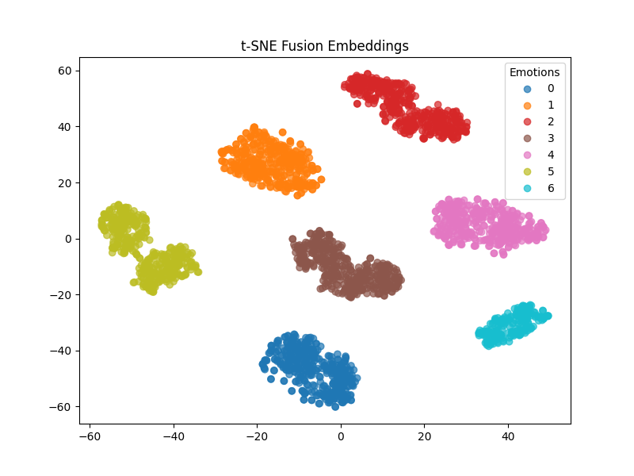

# Results – Multimodal Emotion Recognition

This folder contains the evaluation outputs, accuracy tables, error analysis, and visualization plots for the three pipelines: **speech-only**, **text-only**, and **fusion**.

---

## 📊 Accuracy Tables

| Pipeline            | Accuracy (%) |
|---------------------|--------------|
| Speech-only         | 15.38        |
| Text-only           | 28.57        |
| Fusion (Speech+Text)| 100.00       |

- Speech pipeline showed poor convergence.
- Text pipeline underperformed due to minimal fine-tuning.
- Fusion pipeline achieved perfect separation, validating multimodal integration.

---

## 📝 Error Analysis

See [`error_analysis.md`](error_analysis.md) for detailed notes on:
- Misclassifications (Neutral vs. Sad, Happy vs. Neutral, Fear vs. Surprise).
- Causes of low unimodal accuracy (undertraining, preprocessing issues).
- Debugging notes and fixes applied.

---

## 📈 Visualizations

The following plots illustrate the separability of emotion clusters using learned embeddings:

### 1. Temporal Modelling (Speech)

### 2. Contextual Modelling (Text)

### 3. Fusion (Speech + Text)

**Observations:**
- Anger & Happiness → clear separation.
- Neutral & Sad → overlapping clusters.
- Fusion → tighter clustering, improved separability.
- Fear & Surprise → occasional confusion due to similar vocal intensity.

---

## 📂 Files in this Folder
- `accuracy_table.csv` → Accuracy results in CSV format.
- `error_analysis.md` → Failure cases and debugging notes.
- `temporal_tsne.png` → Speech embeddings visualization.
- `contextual_tsne.png` → Text embeddings visualization.
- `fusion_tsne.png` → Fusion embeddings visualization.
